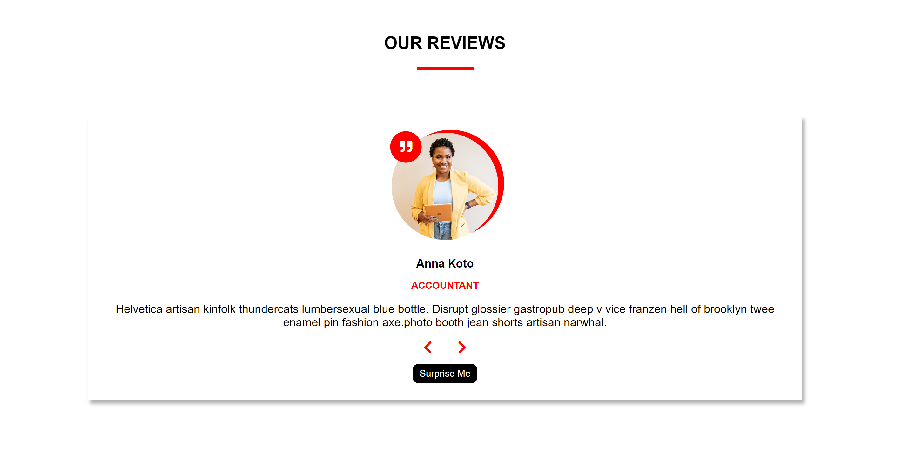

# Reviews Component



## Welcome! 👋

Thanks for checking my mini-project!

This project flips through an array of objects and populates information in the HTML based on it's content.

## Table of contents

- [Overview](#overview)
  - [The challenge](#the-challenge)
  - [Links](#links)
- [My process](#my-process)
  - [Built with](#built-with)
  - [What I learned](#what-i-learned)
- [Author](#author)

## Overview

### The challenge

Users should be able to:

- use the next and previous arrows to cycle through the list of reviews
- use a random button to get a random review

### Links

- Live Site URL: [http://127.0.0.1:5501/reviews-component/index.html](http://127.0.0.1:5501/reviews-component/index.html)

## My process

### Built with

- Semantic HTML5 markup
- CSS Grid
- Vanilla JS

### What I learned

This project was useful to practice dynamically updating properties of HTML elements in response to click events.

```js
function showPerson(array) {
  const update = reviews[count];
  image.src = update.img;
  identity.textContent = update.name;
  job.textContent = update.job;
  desc.textContent = update.text;
}
```

## Author

- Website - [Julia's Portfolio](https://juliawalton.github.io/portfolio/)
- LinkedIn - [Julia Walton](https://www.linkedin.com/in/juliawalton/)
